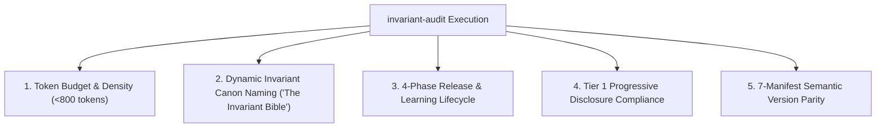

# Living Invariant Audit & Governance Skill (`invariant-audit`)

Use this skill when auditing, verifying, or refactoring the **Living Canon of System Invariants**, `AGENTS.md` context budget, progressive skill declarations, or continuous learning workflows across the Credence ecosystem.

---

## 1. Core Audit Responsibilities

This skill enforces the **3-Tier Invariant Scalability Architecture** across five critical dimensions:



### 1. Token Budget & Context Economy Audit
- Measures token consumption of `AGENTS.md` across all ecosystem repositories.
- Asserts that universal core rules strictly remain **< 800 tokens**.
- Flags procedural bloat (e.g. multi-step CLI commands, vendor-specific GCP flags) for refactoring into specialized Tier 1 skills.

### 2. Dynamic Invariant Canon Naming Audit
- Scans all public web surfaces (`web/`), documentation (`credence-docs/docs/`), sitemaps, and navigation footers.
- Asserts that invariant numerical counts (e.g. "36 Core", "38 Invariants") are never hardcoded.
- Enforces dynamic references to **The Invariant Bible** or **Living Canon of System Invariants**.

### 3. 4-Phase Delivery & Continuous Learning Lifecycle Audit
- Asserts that all ecosystem repositories declare the **4-Phase Release & Learning Lifecycle Invariant**:
  `1. Code & Local QA Gate -> 2. User Mk1 Eyeball Review -> 3. Feature Version Release -> 4. /learn Retrospective -> 5. Apply Lessons as Immediate Patch Release`.
- Validates that feature releases and patch releases are decoupled and properly documented in `docs/changelog.md` and `docs/roadmap.md`.

### 4. Progressive Disclosure & Skills Audit
- Audits `.agents/skills.json` and `.agents/skills/` directory structure.
- Verifies that all specialized skills have valid YAML frontmatter (`name`, `description`).
- Validates that high-contrast dark slate Mermaid styling is applied across all skill diagrams.

### 5. 7-Manifest Semantic Version Parity Audit
- Verifies simultaneous synchronization across all 7 version manifests:
  1. `credence/pyproject.toml`
  2. `credence/credence/__init__.py`
  3. `credence-docs/index.html`
  4. `credence-docs/app.js`
  5. `credence-docs/docs/changelog.md`
  6. `credence/web/credence.run/index.html`
  7. `credence-agent/plugin.json`

### 6. Prioritized Cognitive Taxonomy & Invariant Lifecycle Audit
- Asserts that all 4 `AGENTS.md` files categorize Tier 0 invariants under the **Class α (Sovereign Safety)**, **Class β (Execution Topology)**, and **Class γ (Interface Symmetry)** headers.
- Audits newly proposed invariants for **Demotion Highway eligibility** (checking if the invariant can be verified deterministically via `test_docs_integrity.py` before adding to `AGENTS.md`).
- Enforces upward axiomatic consolidation when total Tier 0 word/token budget approaches threshold.

---

## 2. Turnkey Audit Execution Commands

```bash
# Run complete ecosystem invariant audit
just audit-invariants

# Run targeted shift-left invariant and lifecycle tests
poetry run pytest tests/test_docs_integrity.py -k "lifecycle or invariant or parity"
```

---

## 3. Reference Blueprints & Documentation
- 📘 [`docs/agent-invariants.md`](../../../../credence-docs/docs/agent-invariants.md): Living Canon of System Invariants with mathematical formulas.
- 🏛️ [`docs/blueprints/invariant-scalability-and-knowledge-governance.md`](../../../../credence-docs/docs/blueprints/invariant-scalability-and-knowledge-governance.md): 3-Tier Scalability Architecture Blueprint.
- 🧠 [`docs/agentic/02-continuous-learning-and-invariant-synthesis.md`](../../../../credence-docs/docs/agentic/02-continuous-learning-and-invariant-synthesis.md): Continuous Learning with `/learn`.

### 4. The Cart-Before-the-Horse Order-of-Operations Check
- Verify that every proposed implementation plan is topologically sorted: scrubbers & schemas precede APIs, APIs precede UIs/CLI, and empirical tests precede case study essays.
