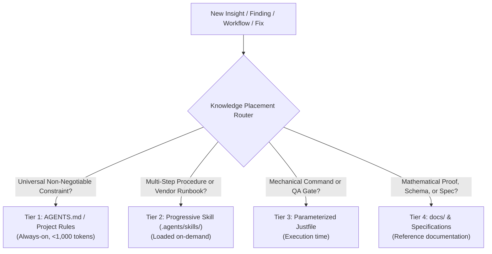

# Knowledge Governance & Context Optimization Skill (`/remember`)

Use this skill when processing `/learn` proposals, post-mortems, or new operational discoveries. This skill prevents **Context Bloat and Attention Dilution** in `AGENTS.md` by routing insights into the lowest-cost cognitive layer using Antigravity's **Progressive Disclosure** architecture.

---

## 1. The 4-Tier Knowledge Taxonomy

When synthesizing new insights, evaluate each finding against this decision matrix:

### Tier 1: Core System Invariants (`AGENTS.md`)
- **Loading Mode**: `always_on` (injected on every single turn).
- **Target Size Budget**: **< 1,000 tokens** total across all sections.
- **Strictly Reserved For**:
  - Critical security boundaries (SSRF rejection, Billion Laughs XML entity protection).
  - Universal architectural constraints (Zero-npm invariant, $15/mo budget ceiling, scale-to-zero compute).
  - Immutable cryptographic & protocol contracts (Ed25519 canonical RFC 8785 JSON, Mk1 human review before commits).
  - Cross-interface behavioral contracts (Non-blocking lifespan startup, synchronous 4-interface parity).
- **Format**: Concise 1-2 sentence invariant rules. Never embed multi-step execution steps or vendor CLI guides here.

### Tier 2: Specialized Progressive Skills (`.agents/skills/<name>/SKILL.md`)
- **Loading Mode**: On-Demand (Only title and description are in the root prompt; full body loads when activated).
- **Target Size**: Unlimited per skill (50-200 lines typical).
- **Best For**:
  - Multi-step procedural runbooks and troubleshooting workflows.
  - Vendor-specific operations (`cloudrun-ops`, `white-label-ops`, `chrome-devtools`).
  - Complex domain simulations (`mesh-cluster`, `epistemic-benchmark`).
  - Diagnostic and triage playbooks (`a11y-debugging`, `memory-leak-debugging`).

### Tier 3: Declarative Automation (`Justfile` & Tooling)
- **Loading Mode**: Execution Time (invoked by operator or agent).
- **Best For**:
  - Mechanical command shortcuts with parameterization (`just gcp status`, `just test unit`, `just preflight all`).
  - Automated dependency prerequisite gates (`(preflight "gcloud")`).
  - Compound QA gates (`just check`, `just doctor`, `just ignite`).

### Tier 4: Architectural Specifications & Deep Docs (`docs/`)
- **Loading Mode**: Manual Reference (viewed via `view_file` or static web).
- **Best For**:
  - Mathematical formulas, proofs, and entropy thresholds (e.g. `docs/agent-invariants.md`).
  - Schema.org JSON-LD contracts, API specifications, and whitepapers.
  - Historical architecture blueprints and release history.

---

## 2. Knowledge Routing Workflow (`/remember`)

When `/learn` or a session retrospective proposes additions:

1. **Step 1: Classification & Routing**:
   - For each proposal, determine whether it is a Universal Invariant (Tier 1), a Progressive Skill (Tier 2), a Justfile Recipe (Tier 3), or Deep Documentation (Tier 4).
2. **Step 2: Distill Invariants**:
   - If routing to Tier 1, distill the rule into a single high-density invariant. If it has procedural steps, move those steps into a Tier 2 skill and link to it.
3. **Step 3: Pruning & Refactoring Audit**:
   - Inspect `AGENTS.md`. If `AGENTS.md` exceeds 1,000 tokens or contains procedural bloat (e.g., shell commands, multi-step GCP instructions), refactor that content into a dedicated skill in `.agents/skills/`.
4. **Step 4: Target Version Disclosure & Parity**:
   - Explicitly declare the target Semantic Version about to be released (e.g. `v1.7.0` / `v1.8.0`) in the walkthrough briefing.
   - Synchronize updates across all ecosystem `AGENTS.md` files (`credence/AGENTS.md`, `credence-docs/AGENTS.md`, `credence-agent/AGENTS.md`, root `AGENTS.md`).
   - Run `just check` to ensure all frontmatter, integrity tests, and agent checks pass.
