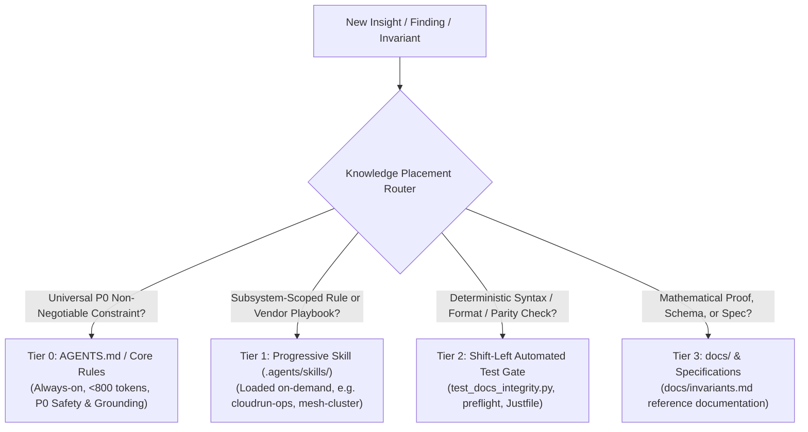
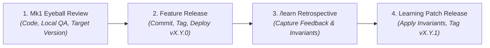

# Knowledge Governance & Context Optimization Skill (`/remember`)

Use this skill when processing `/learn` proposals, post-mortems, or new operational discoveries. This skill prevents **Context Bloat and Attention Dilution** in `AGENTS.md` by routing insights into the lowest-cost cognitive layer using Antigravity's **Progressive Disclosure** architecture.

---

## 1. The 3-Tier Invariant Scalability & Knowledge Placement Architecture

When synthesizing new insights, evaluate each finding against this scalability matrix to prevent context bloat and attention dilution:

### Tier 0: Universal Core Invariants (`AGENTS.md`)
- **Loading Mode**: `always_on` (injected on every single turn).
- **Target Size Budget**: **< 800 tokens** total across all sections.
- **Strictly Reserved For**:
  - Human review before commits ("Mk1 Eyeball") & explicit target version disclosure.
  - Critical security boundaries (Network SSRF rejection, Billion Laughs XML entity protection).
  - Epistemic verbatim grounding ($G=1.00$) and 50% anti-hallucination slashing.
  - Immutable cryptographic contracts (Ed25519 canonical RFC 8785 JSON, anti-tampering).
  - Universal 4-interface feature parity & Zero-npm Web Standard.
  - Session-driven documentation expansion.
- **Format**: High-density 1-sentence invariant rules. Never embed multi-step execution steps or vendor CLI guides here.

### Tier 1: Specialized Progressive Skills (`.agents/skills/<name>/SKILL.md`)
- **Loading Mode**: On-Demand (Only title and description are in the root prompt; full body loads when activated).
- **Target Size**: Unlimited per skill (50-200 lines typical).
- **Best For**:
  - Subsystem-scoped rules (e.g. Cloud Run scale-to-zero cold start optimization in `cloudrun-ops`).
  - Multi-step procedural runbooks and troubleshooting workflows (`white-label-ops`, `mesh-cluster`).
  - Complex domain simulations (`epistemic-benchmark`).

### Tier 2: Shift-Left Automated Integrity Test Gates (`tests/test_docs_integrity.py` & `Justfile`)
- **Loading Mode**: Execution Time (`just check` runs in <0.3s).
- **Best For**:
  - Mechanical constraints that do not require LLM system prompt memory:
    - Markdown YAML frontmatter validation (`test_all_markdown_files_valid_frontmatter`).
    - Markdown code fence column-0 and syntax validation (`test_all_markdown_code_fences_and_syntax`).
    - Zero-npm assertion (`test_zero_npm_invariant`).
    - 7-Manifest version parity across repos (`test_ecosystem_version_parity`).
    - Sitemap route coverage & deep link validation.
    - Mermaid WCAG contrast validation.

### Tier 3: Architectural Specifications & Deep Docs (`docs/`)
- **Loading Mode**: Manual Reference (viewed via `view_file` or static web).
- **Best For**:
  - The Invariant Bible, mathematical formulas, proofs, and entropy thresholds (e.g. `docs/agent-invariants.md`).
  - Schema.org JSON-LD contracts, API specifications, and whitepapers.

---

## 2. The 4-Phase Delivery & Continuous Learning Lifecycle

Ecosystem development and knowledge synthesis strictly follow a 4-phase sequential progression:

### Phase 1: Code, Local QA & Mk1 Eyeball Review
- Implement features with local unit tests, documentation integrity tests, and static checks (`just check`).
- Present all working-tree diffs, test logs, and explicitly declare the target Semantic Version (e.g. `v1.23.0`) for human inspection ("Mk1 Eyeball").

### Phase 2: Feature Version Release
- Upon user approval, commit with a clean working tree (`git diff --quiet`).
- Synchronize version manifests (`just sync-version X.Y.0`), tag git repositories (`just git-sync tag X.Y.0`), push to GitHub (`just git-sync push`), and verify live automated CI/CD deployment on Cloud Run / Cloudflare Edge.

### Phase 3: `/learn` Retrospective
- Review session corrections, security requirements, and operational discoveries.
- Classify new insights using the **3-Tier Scalability Architecture** (Tier 0 Universal Invariants, Tier 1 Progressive Skills, Tier 2 Shift-Left Tests, Tier 3 Documentation).
- Draft and present `learning_proposal.md` for human review.

### Phase 4: Apply Lessons as Patch Release
- Upon approval of the learning proposal, apply the invariant rules to `AGENTS.md`, update specialized `.agents/skills/`, and add shift-left contract tests in `tests/`.
- Bump the version to the next patch release (e.g. `vX.Y.1`), run `just check`, present changes for Mk1 review, commit, tag, and push as the **learning patch release**.

---

## 3. Documentation Progressive Disclosure & Search Indexing

Whenever creating or modifying documentation across `credence-docs/` or landing pages (`credence.run`):

### The 5-Level Progressive Disclosure Hierarchy (Anti-Firehose)
1. **Level 1: The Hook & Value Prop**: Explain the project in plain English with everyday relatable examples (cut clickbait, spot fallacies, zero AI hallucinations). Never lead with Greek notation ($Q_i$), raw enum identifiers, or complex consensus math.
2. **Level 2: 60-Second Quickstart**: Provide a 3-step jump-in command card (`curl ... | bash` $\to$ `credence audit <url>` $\to$ `credence tui`).
3. **Level 3: Everyday Use Cases & Interfaces**: Highlight the 4 ways to use Credence (Terminal CLI, AI Assistant FastMCP, Textual TUI Workstation, Web Report Viewer).
4. **Level 4: Core Concepts Simply Explained**: Clear intuitive explanations of verbatim grounded quotes, ethical taxonomy standards (SPJ, IEP), satire protection (Poe's Law), and Ed25519 cryptographic receipts.
5. **Level 5: Deep Dives & Specifications**: Direct, well-organized links to formal proofs, 36 system invariants, P2P mesh dynamics, and multi-cloud operations.

### Concept Searchability & Indexing (Anti-Oatmeal)
1. **Rich Registry Metadata**: Every document entry in `DOCS_REGISTRY` (`app.js`) must include a 1-line `desc` and a `keywords` array of relevant terms, tool names, synonyms, and subcommands.
2. **Master Topic Index Synchronized**: Every new guide, feature, command, or invariant must be linked in `docs/topic-index.md` ("The Marbles in the Oatmeal" directory).
3. **Cross-Navigation Footers**: End every core tutorial or guide with a "Next Steps & Related Marbles" section.

---

## 4. Documentation Freshness Auditing & Version Provenance

To prevent documentation from presenting obsolete models (e.g. `gemini-1.5`, `gpt-3.5`), deprecated flags, or outdated system architectures as the ecosystem advances:

### Mandatory Frontmatter Provenance Fields
Every `.md` document in `docs/` and `blog/` must maintain three version provenance fields:
- `since_version`: The semantic version when the feature/article was first published (e.g. `v1.0.0`, `v1.8.0`).
- `verified_version`: The most recent semantic version against which the document's code samples, commands, and architecture were audited and verified (e.g. `v1.15.0`).
- `last_verified`: The ISO-8601 date of the last verification audit (e.g. `2026-08-19`).

### Major Release Documentation Audit Procedure
During major release cycles:
1. **Freshness Scan**: Run `pytest tests/test_docs_integrity.py` to assert that all documentation markdown files have valid `since_version` and `verified_version` frontmatter.
2. **Obsolete Pattern Elimination**: Audit markdown bodies to eliminate legacy CLI patterns (e.g. `poetry run credence serve` &rarr; direct virtualenv execution), outdated LLM models, and deprecated cloud deployment flags.
3. **Bump Verification Metadata**: Update `verified_version` to target release (e.g. `v1.15.0`) and `last_verified` to the current release date.

### Visual Portal Provenance Badges
The zero-build docs engine (`app.js`) automatically renders:
- `✅ Verified in vX.X.X` (green badge) for documents verified in the latest release.
- `🟡 Verified in vX.X.X` (yellow badge) for documents needing a freshness review.
- `📦 Added in vX.X.X` (neutral badge) showing historical version provenance.

---

## 5. Socratic Architecture Pre-Mortems & Prompt Budget Invariants (`/grill-me` & `<800 Tokens`)

### Socratic Architecture Review Checklist (`/grill-me`)
Before implementing major structural changes, subject the plan to the **4-Round Socratic Interrogation**:
1. **The Invariant Stress Test:** Does the proposal violate any of Credence's 38 core invariants (e.g. Zero-npm, Hermetic Unit Testing, $G=1.00$ Verbatim Grounding)?
2. **The Simplicity Veto:** Can this feature be implemented with zero new dependencies using standard library primitives and native W3C standards (WebCrypto, ES Modules)?
3. **Partition & Partition Resilience:** What happens if the network splits or a Cloud Run instance scales to zero? Is state preserved locally via CAS/WAL?
4. **Cognitive Economy Audit:** Does this proposal add necessary capabilities without dumping formatting trivia or procedural bloat into root `AGENTS.md`?

### Prompt Context Budget Governance
- **Strict `< 800-token` Hard Ceiling:** Root `AGENTS.md` must be kept under 800 tokens.
- **Rule Pruning:** Whenever a new Tier-0 invariant is proposed, audit existing rules. If a rule can be verified mechanically (e.g. frontmatter or sitemaps), move it into `tests/test_docs_integrity.py` (Tier 2).

